**Streamlined Enterprise RAG for JIRA Ticket Analysis**

A powerful yet simple Retrieval-Augmented Generation (RAG) system that combines OpenAI's GPT models with Chroma vector database for intelligent JIRA ticket search and analysis. Supports multiple data sources (CSV, S3, Confluence) with namespace organization.

## 🎯 Key Features

- OpenAI (GPT + Embeddings) + Chroma Vector DB
- **Data Sources**: CSV files, S3 buckets, Confluence spaces, or mixed mode
- **Namespace**: Organize data by environment, project, or source
- **Conversational Interface**: Memory-enabled chat with context awareness
- **Batch Processing**: Efficient handling of large datasets

## 🏗️ Architecture Overview

```mermaid
graph TB
    subgraph "Data Sources"
        CSV[📊 CSV Files]
        S3[☁️ S3 Buckets]
        CONF[📄 Confluence]
    end
    
    subgraph "Processing Layer"
        LOAD[Data Loader]
        SPLIT[Text Splitter]
        EMBED[OpenAI Embeddings]
    end
    
    subgraph "Storage Layer"
        CHROMA[(🗄️ Chroma Vector DB)]
        NS[Namespaces]
    end
    
    subgraph "AI Layer"
        GPT[🤖 OpenAI GPT]
        QA[Q&A Chain]
        CONV[Conversation Chain]
        MEM[Memory Buffer]
    end
    
    subgraph "Interface Layer"
        CLI[💬 Chat Interface]
        API[🔧 Python API]
    end
    
    CSV --> LOAD
    S3 --> LOAD
    CONF --> LOAD
    
    LOAD --> SPLIT
    SPLIT --> EMBED
    EMBED --> CHROMA
    CHROMA --> NS
    
    CHROMA --> QA
    CHROMA --> CONV
    GPT --> QA
    GPT --> CONV
    MEM --> CONV
    
    QA --> CLI
    CONV --> CLI
    QA --> API
    CONV --> API
```




</details>

## 🧠 Technology Choices & RAG Explained

### Why LangChain?

**LangChain** is the orchestration framework that makes RAG possible by providing:

- **Chain Abstraction**: Pre-built chains (Q&A, Conversational) that handle complex workflows
- **Document Processing**: Text splitting, loading, and transformation utilities
- **Provider Integration**: Seamless integration with OpenAI, Chroma, and other services
- **Memory Management**: Conversation context and chat history handling
- **Extensibility**: Easy to add new data sources, models, or processing steps

Without LangChain, we'd need to manually implement document chunking, embedding generation, vector similarity search, prompt engineering, and chain-of-thought reasoning.

### What is RAG (Retrieval-Augmented Generation)?

**RAG** combines the power of information retrieval and text generation:

1. **Retrieval**: Find relevant documents from your knowledge base using vector similarity
2. **Augmentation**: Inject found documents as context into the prompt
3. **Generation**: Use LLM to generate answers based on retrieved context

**Why RAG vs. Fine-tuning?**
- ✅ **Dynamic Knowledge**: Update knowledge without retraining
- ✅ **Cost Effective**: No expensive model training
- ✅ **Transparency**: See source documents for each answer
- ✅ **Fresh Data**: Works with real-time data updates

### Architecture Components

#### 🤖 **Where GPT is Used**

**Primary Role**: Answer generation and reasoning
- **Q&A Chain**: Generates direct answers to questions using retrieved context
- **Conversational Chain**: Maintains dialogue context and generates conversational responses
- **Query Understanding**: Interprets user intent and reformulates queries if needed

**GPT Models Used**:
- `gpt-3.5-turbo` (default) - Fast, cost-effective for most queries
- `gpt-4` - More accurate for complex reasoning (configurable)

#### 📊 **Data Processing Pipeline**

**1. Data Loaders**
- **Purpose**: Standardize data ingestion from multiple sources
- **CSV Loader**: Pandas-based parsing with JIRA ticket structure
- **S3 Loader**: Boto3 integration for cloud data access
- **Confluence Loader**: LangChain connector for documentation

**2. Text Splitter**
- **Purpose**: Break large documents into searchable chunks
- **Method**: Recursive character splitting with overlap
- **Why Needed**: Embeddings work best on focused text segments
- **Configuration**: 1000 chars per chunk, 200 char overlap (default)

**3. OpenAI Embeddings**
- **Purpose**: Convert text to vector representations for similarity search
- **Model**: `text-embedding-3-small` (1536 dimensions)
- **Process**: Each text chunk becomes a vector that captures semantic meaning
- **Storage**: Vectors stored in Chroma for fast retrieval

#### 🗄️ **Vector Database (Chroma)**

**Purpose**: Semantic search engine for documents
- **Storage**: Persistent vector embeddings with metadata
- **Search**: Cosine similarity to find relevant documents
- **Namespaces**: Logical separation of different data collections
- **Advantages**: Fast similarity search, metadata filtering, local storage

#### 🔗 **RAG Chains Explained**

**1. Q&A Chain (Simple)**
```
User Query → Vector Search → Retrieve Top-K Documents → GPT Prompt:
"Answer the question based on the following context: [documents]
Question: [user_query]"
```

**2. Conversational Chain (Advanced)**
```
User Query + Chat History → Vector Search → Retrieve Relevant Docs → GPT Prompt:
"Given the conversation history and context documents, 
continue the conversation naturally:
History: [chat_history]
Context: [documents] 
Human: [user_query]
Assistant:"
```

#### 💾 **Memory Management**

**Purpose**: Maintain conversation context across multiple queries
- **ConversationBufferMemory**: Stores full chat history
- **Integration**: Automatically included in conversational chain
- **Benefits**: Follow-up questions, context awareness, natural dialogue

#### 🏷️ **Namespace System**

**Purpose**: Data organization and multi-tenancy
- **Collection Naming**: `{collection_name}_{namespace}` (e.g., "enterprise-rag_production")
- **Use Cases**: Separate environments (dev/staging/prod), projects, or data sources
- **Benefits**: Data isolation, A/B testing, gradual rollouts

#### 📈 **Performance Optimizations**

**Batch Processing**
- **Why**: Efficient processing of large datasets
- **How**: Process documents in configurable batches (default: 100)
- **Benefits**: Memory management, progress tracking, fault tolerance

**Caching**
- **Embedding Cache**: Avoid re-computing embeddings for same text
- **Query Cache**: Store recent query results
- **Benefits**: Faster response times, reduced API costs

**Parallel Processing**
- **Where**: Document processing, embedding generation
- **Configuration**: Max workers (default: 4)
- **Benefits**: Faster initial setup, better resource utilization

### 🔄 Complete RAG Workflow

1. **Data Ingestion**: Load from CSV/S3/Confluence
2. **Text Processing**: Split into chunks, add metadata
3. **Vectorization**: Generate embeddings via OpenAI
4. **Storage**: Store in Chroma with namespace
5. **Query Processing**: Vector search for relevant chunks
6. **Context Assembly**: Combine retrieved documents
7. **Answer Generation**: GPT generates response with sources
8. **Memory Update**: Store conversation for follow-ups

This architecture provides a scalable, maintainable RAG system that balances simplicity with powerful functionality.

## 📊 Data Flow Diagrams

### 1. Data Loading Flow

```mermaid
flowchart TD
    START([Start Data Loading]) --> SOURCE{Data Source?}
    
    SOURCE -->|CSV| CSV_LOAD[📊 Load CSV File]
    SOURCE -->|S3| S3_LOAD[☁️ Download from S3]
    SOURCE -->|Confluence| CONF_LOAD[📄 Fetch from Confluence]
    SOURCE -->|Mixed| MIXED_LOAD[🔄 Try All Sources]
    
    CSV_LOAD --> PANDAS[Parse with Pandas]
    S3_LOAD --> PANDAS
    CONF_LOAD --> DOCS[LangChain Documents]
    MIXED_LOAD --> FALLBACK[Graceful Fallbacks]
    
    PANDAS --> CONVERT[Convert to Documents]
    CONVERT --> DOCS
    FALLBACK --> DOCS
    
    DOCS --> METADATA[Add Metadata Schema]
    METADATA --> SPLIT[Text Splitting]
    SPLIT --> BATCH{Batch Mode?}
    
    BATCH -->|Yes| BATCH_PROC[Batch Processing]
    BATCH -->|No| SINGLE_PROC[Single Processing]
    
    BATCH_PROC --> EMBED[Generate Embeddings]
    SINGLE_PROC --> EMBED
    
    EMBED --> STORE[Store in Chroma]
    STORE --> NAMESPACE[Apply Namespace]
    NAMESPACE --> DONE([✅ Data Ready])
```



</details>

### 2. Query Processing Flow

```mermaid
flowchart TD
    QUERY([User Query]) --> MODE{Conversation Mode?}
    
    MODE -->|Yes| CONV_CHAIN[🗣️ Conversational Chain]
    MODE -->|No| QA_CHAIN[❓ Q&A Chain]
    
    CONV_CHAIN --> MEMORY[Check Memory Buffer]
    MEMORY --> CONTEXT[Add Chat History]
    CONTEXT --> VECTOR_SEARCH
    
    QA_CHAIN --> VECTOR_SEARCH[🔍 Vector Similarity Search]
    
    VECTOR_SEARCH --> CHROMA[(Chroma Database)]
    CHROMA --> NAMESPACE[Filter by Namespace]
    NAMESPACE --> RETRIEVE[Retrieve Top-K Documents]
    
    RETRIEVE --> RERANK{Reranking Enabled?}
    RERANK -->|Yes| RERANK_DOCS[Re-rank Results]
    RERANK -->|No| CONTEXT_DOCS[Context Documents]
    RERANK_DOCS --> CONTEXT_DOCS
    
    CONTEXT_DOCS --> LLM[🤖 OpenAI GPT]
    LLM --> GENERATE[Generate Answer]
    GENERATE --> UPDATE_MEM[Update Memory]
    UPDATE_MEM --> RESPONSE([📄 Response + Sources])
```



</details>

## 🧩 Core Components

### 1. Configuration System (`config.py`)
- **Purpose**: Centralized configuration with environment variable support
- **Key Settings**: 
  - OpenAI API settings (model, temperature, API key)
  - Data source configuration (CSV path, S3 bucket, Confluence settings)
  - Vector store settings (path, namespace, collection name)
  - Performance optimizations (batch size, parallel processing, caching)

### 2. Enterprise RAG Engine (`enterprise_rag.py`)
- **Purpose**: Core RAG functionality with multiple data source support
- **Key Methods**:
  - `load_data()` - Multi-source data loading with fallbacks
  - `setup_vectorstore()` - Chroma vector database initialization
  - `setup_chains()` - Q&A and conversation chain setup
  - `query()` - Query processing with context retrieval
  - `list_namespaces()` / `switch_namespace()` - Namespace management

### 3. Schema System (`schema.py`)
- **Purpose**: Structured metadata for documents with validation
- **Features**:
  - Document metadata standardization
  - Source-specific metadata handling (JIRA, Confluence)
  - Vector store schema validation

### 4. Chat Interface (`chat.py`)
- **Purpose**: Interactive command-line interface
- **Features**:
  - Conversational chat with memory
  - Built-in commands (`stats`, `namespaces`, `switch`, `clear`)
  - Source document attribution

### 5. Data Processor (`process.py`)
- **Purpose**: Batch data processing and vector store setup
- **Features**:
  - Command-line arguments for flexible processing
  - Batch processing for large datasets
  - Force reload and verbose output options

## 📚 Libraries Used

### Core Dependencies
- **LangChain** (`langchain>=0.2.0`) - RAG framework and document processing
- **LangChain OpenAI** (`langchain-openai>=0.1.0`) - OpenAI GPT and embeddings integration
- **LangChain Chroma** (`langchain-chroma>=0.1.0`) - Chroma vector database integration
- **Pandas** (`pandas>=2.0.0`) - CSV data processing and manipulation
- **Python-dotenv** (`python-dotenv>=1.0.0`) - Environment variable management


## 🚀 Quick Start

### 1. Prerequisites
```bash
# Python 3.8+ required
python --version

# Clone or download the project
git clone <your-repo-url>
cd EnterpriseRAG-TicketsAnalyzer
```

### 2. Environment Setup
```bash
# Create virtual environment
python3 -m venv venv
source venv/bin/activate  # On Windows: venv\Scripts\activate

# Install dependencies
pip install -r requirements.txt
```

### 3. Configuration
```bash

# Edit .env file with your settings
nano .env
```

**Essential Configuration:**
```env
# OpenAI (Required)
OPENAI_API_KEY=your_openai_api_key_here

# Data Source
DATA_SOURCE=csv  # Options: csv, s3, confluence, mixed
CSV_PATH=./data/org_Jira.csv

# Vector Store
VECTOR_STORE_PATH=./vectorstore
NAMESPACE=production
COLLECTION_NAME=enterprise-rag
```

### 4. Data Processing
```bash
# Process your data into vector embeddings
python process.py

# Or with custom settings
python process.py --data-source csv --csv-path ./data/tickets.csv --namespace dev
```

### 5. Start Chatting
```bash
# Launch interactive chat interface
python chat.py
```

**Example Chat Session:**
```
🚀 Initializing Enterprise RAG System...
📊 Ready! Loaded 1,000 documents
🤖 Using gpt-3.5-turbo with text-embedding-3-small

Q: What are the most common bug types in our system?
A: Based on the JIRA tickets, the most common bug types are:
1. Authentication issues (23% of bugs)
2. Database connection problems (18%)
3. UI rendering issues (15%)
📄 Sources: TICKET-1234, TICKET-5678, TICKET-9012

Q: namespaces
📂 Available namespaces: production, staging, development
📍 Current namespace: production

Q: switch development
✅ Switched to namespace: development
```


## 🔧 Configuration Options

<details>
<summary>Click to view all configuration options</summary>

### Core Settings
- `OPENAI_API_KEY` - Your OpenAI API key (required)
- `DATA_SOURCE` - Data source type: csv, s3, confluence, mixed
- `VECTOR_STORE_PATH` - Path to store vector database
- `NAMESPACE` - Namespace for data organization
- `COLLECTION_NAME` - Chroma collection name

### Data Sources
- `CSV_PATH` - Path to CSV file
- `S3_BUCKET` / `S3_KEY` - S3 bucket and key
- `CONFLUENCE_URL` / `CONFLUENCE_USERNAME` / `CONFLUENCE_API_TOKEN` / `CONFLUENCE_SPACE_KEY` - Confluence settings

### AI Models
- `LLM_MODEL` - OpenAI model (default: gpt-3.5-turbo)
- `EMBEDDING_MODEL` - Embedding model (default: text-embedding-3-small)
- `LLM_TEMPERATURE` - Model temperature (default: 0.7)

### Performance
- `BATCH_SIZE` - Documents per batch (default: 100)
- `BATCH_MODE` - Enable batch processing (default: true)
- `ENABLE_PARALLEL` - Enable parallel processing (default: true)
- `MAX_WORKERS` - Number of parallel workers (default: 4)

### Optimization
- `ENABLE_CACHING` - Enable caching (default: true)
- `CACHE_DIR` - Cache directory (default: ./cache)
- `RETRIEVAL_K` - Number of documents to retrieve (default: 5)
- `CHUNK_SIZE` - Text chunk size (default: 1000)
- `CHUNK_OVERLAP` - Text chunk overlap (default: 200)

</details>

## 🌟 Advanced Features

### Namespace Management
Organize your data by environment, project, or source:
```python
# List available namespaces
namespaces = rag.list_namespaces()
print(f"Available: {namespaces}")

# Switch namespace
rag.switch_namespace('staging')

# Each namespace maintains separate vector stores
```

### Mixed Data Sources
Load data from multiple sources with graceful fallbacks:
```python
config = Config()
config.data_source = "mixed"
config.csv_path = "./data/tickets.csv"
config.s3_bucket = "backup-bucket"
config.confluence_space_key = "DEV"

# System will try all sources and load what's available
rag = EnterpriseRAG(config)
```

### Conversation Memory
Maintain context across multiple queries:
```python
# First query
result1 = rag.query("What are critical bugs?")

# Follow-up query with context
result2 = rag.query("How many of those are security related?")

# Clear memory when needed
rag.clear_memory()
```

## 🎯 Use Cases

### 📊 **Ticket Analysis & Search**
1. **JIRA Ticket Analysis**: Search and analyze bug reports, feature requests
2. **Knowledge Base Search**: Query Confluence documentation  
3. **Incident Response**: Find similar past incidents and solutions
4. **Documentation Q&A**: Get answers from technical documentation

### 🔍 **Pattern Recognition & Insights**
5. **Repetitive Task Identification**: "What tasks do we solve repeatedly that could be automated?"
6. **Low-Value Work Analysis**: "What are the least valuable tasks developers spend time on?"
7. **Technical Debt Discovery**: "What technical debt issues keep appearing in our tickets?"
8. **Trend Analysis**: Identify patterns in support tickets over time

### 🚀 **Process Optimization**
9. **Automation Opportunities**: Find recurring manual processes suitable for automation
10. **Resource Allocation**: Understand where development effort is being spent
11. **Quality Hotspots**: Identify components with frequent issues
12. **Knowledge Gaps**: Find areas where documentation or training is needed

### 📈 **Strategic Planning**
13. **Feature Impact Analysis**: Analyze user feedback and feature request patterns
14. **Security Audit**: Find security-related issues and vulnerabilities across tickets
15. **Performance Issues**: Identify recurring performance bottlenecks
16. **Customer Pain Points**: Understand most common user complaints and issues

### 💡 **Example Queries**
- *"What are the most common manual deployment issues that could be automated?"*
- *"Which components have the highest technical debt based on ticket history?"*
- *"What repetitive bug fixes indicate automation opportunities?"*
- *"What low-impact tasks are consuming developer time?"*
- *"Which areas need better documentation based on support tickets?"*


